# Fault

**Catch AI agent mistakes before they hit your codebase.**

[](https://github.com/joeabbey/fault/actions/workflows/ci.yml)
[](https://go.dev)
[](LICENSE)

Fault validates multi-file changes from Claude Code, aider, and Cursor — catching broken imports, stale references, and missing tests before you commit.

## The problem

AI coding agents are fast. They scaffold entire features across a dozen files in seconds. But they make structural mistakes that are easy to miss:

- An import references a module that was never created
- A function signature changed but not all callers were updated
- A file was renamed but old references remain in three other files
- TODO placeholders were left behind as "implementation notes"

These errors compile, pass a quick scan, and slip into your commit history. You find them later when something breaks in production.

**Traditional linters check syntax within a single file. Fault checks the relationships between files.**

## Install

```bash
curl -sSf https://fault.jabbey.io/install.sh | sh
```

Or from source:

```bash
go install github.com/joeabbey/fault/cmd/fault@latest
```

## Quick start

```bash
fault init              # Generate .fault.yaml config
fault hook install      # Install as pre-commit hook
fault check --staged    # Validate staged changes
fault check             # Validate unstaged changes
```

## What Fault catches

| Check | Single-file linter | Fault |
|-------|:--:|:--:|
| Syntax errors | Yes | Use your linter |
| Broken imports across files | | **Yes** |
| Signature changes with stale callers | | **Yes** |
| References to deleted/renamed files | | **Yes** |
| Missing test updates | | **Yes** |
| Agent artifacts (TODOs, debug logs) | Partial | **Yes** |
| Security anti-patterns | | **Yes** |
| Hallucinated APIs/functions | | **Yes** |

## How it works

```mermaid
flowchart TB
    subgraph input ["  Input  "]
        A["🤖 AI Agent\nClaude Code · aider · Cursor"]
        B["📂 git commit"]
    end

    subgraph fault ["  Fault  "]
        C["🔗 Pre-commit Hook"]
        D["📄 Parse Changed Files"]
        subgraph analyzers ["  12 Analyzers · Parallel Execution  "]
            direction LR
            E1["Imports"] ~~~ E2["Consistency"] ~~~ E3["References"] ~~~ E4["Tests"]
            E5["Patterns"] ~~~ E6["Security"] ~~~ E7["Hallucination"] ~~~ E8["+ 5 more"]
        end
    end

    subgraph output ["  Result  "]
        G["🚫 Block Commit\nShow what to fix"]
        H["✅ Commit Proceeds"]
    end

    A --> B --> C --> D --> analyzers
    analyzers -- "Issues found" --> G
    analyzers -- "All clear" --> H

    style input fill:#1e1e2e,stroke:#f43f5e,stroke-width:1px,color:#e2e8f4
    style fault fill:#0e1017,stroke:#f43f5e,stroke-width:2px,color:#e2e8f4
    style analyzers fill:#1a1a2e,stroke:#fb7185,stroke-width:1px,color:#e2e8f4
    style output fill:#1e1e2e,stroke:#f43f5e,stroke-width:1px,color:#e2e8f4
    style A fill:#2a2a3e,stroke:#f43f5e,color:#e2e8f4
    style B fill:#2a2a3e,stroke:#f43f5e,color:#e2e8f4
    style C fill:#f43f5e,stroke:#e11d48,color:#fff
    style D fill:#2a2a3e,stroke:#fb7185,color:#e2e8f4
    style G fill:#e11d48,stroke:#be123c,color:#fff
    style H fill:#059669,stroke:#047857,color:#fff
    style E1 fill:#2a2a3e,stroke:#fb7185,color:#e2e8f4
    style E2 fill:#2a2a3e,stroke:#fb7185,color:#e2e8f4
    style E3 fill:#2a2a3e,stroke:#fb7185,color:#e2e8f4
    style E4 fill:#2a2a3e,stroke:#fb7185,color:#e2e8f4
    style E5 fill:#2a2a3e,stroke:#fb7185,color:#e2e8f4
    style E6 fill:#2a2a3e,stroke:#fb7185,color:#e2e8f4
    style E7 fill:#2a2a3e,stroke:#fb7185,color:#e2e8f4
    style E8 fill:#2a2a3e,stroke:#fb7185,color:#e2e8f4
```



### Analyzers

Fault runs 12 analyzers in parallel against your git diff:

| Analyzer | What it catches |
|----------|-----------------|
| **Imports** | References to nonexistent exports, removed exports still imported |
| **Consistency** | Function signatures changed without updating callers |
| **References** | Deleted/renamed files still referenced elsewhere |
| **Tests** | Changed functions without corresponding test updates |
| **Patterns** | TODO placeholders, debug artifacts, commented-out code |
| **Security** | Hardcoded credentials, injection risks, insecure patterns |
| **Hallucination** | Calls to APIs or functions that don't exist in your codebase |
| **Complexity** | Excessive cyclomatic complexity in changed code |
| **Concurrency** | Race conditions, deadlock patterns, unsafe shared state |
| **Resource** | Unclosed handles, leaked connections, missing cleanup |
| **Migration** | Schema changes without migration files |
| **Doc Drift** | Code changes that invalidate existing documentation |

## Language support

Fault supports **42 languages** including Go, TypeScript, Python, Java, Rust, Ruby, Kotlin, C#, Swift, C/C++, Zig, Haskell, Elixir, Terraform, Solidity, and [many more](docs/languages.md).

## Integrations

| Tool | Integration |
|------|-------------|
| **Claude Code** | Pre-commit hook or [Claude Code hooks](docs/claude-code-integration.md) |
| **aider** | Pre-commit hook or [`--lint-cmd`](docs/aider-integration.md) |
| **Cursor** | Pre-commit hook |
| **GitHub Actions** | [SARIF output](docs/github-actions.md) for Code Scanning |
| **Any git workflow** | If it commits to git, Fault can validate it |

## Output formats

```bash
fault check                    # Terminal (colored, human-readable)
fault check --format=json      # JSON (for scripts/CI)
fault check --format=sarif     # SARIF v2.1.0 (GitHub Code Scanning)
fault check --format=github    # GitHub Actions annotations
```

## Configuration

Create `.fault.yaml` in your project root (or run `fault init`):

```yaml
version: 1
languages: [go, typescript, python]
block_on: error

analyzers:
  imports: true
  consistency: true
  references: true
  tests: true
  patterns: true
  security: true
  hallucination: true

llm:
  enabled: false
  spec_file: ""

ignore:
  - "vendor/"
  - "node_modules/"
  - "*.generated.*"
```

## Pro features

Set `FAULT_API_KEY` to enable AI-powered analysis:

- **Confidence scoring** — Per-file confidence scores with reasoning
- **Spec comparison** — Compare changes against a requirements document
- **Auto-fix** — Generate and apply fixes for detected issues

```bash
fault signup --email you@example.com   # Get an API key
fault fix --dry-run                    # Preview auto-fixes
```

See [fault.jabbey.io](https://fault.jabbey.io) for pricing and plans.

## Development

```bash
make build          # Build CLI binary
make build-cloud    # Build cloud API server
make test           # Run tests with race detection
make release        # Cross-compile for all platforms
```

## Documentation

- [Getting Started](docs/getting-started.md)
- [GitHub Actions](docs/github-actions.md)
- [Claude Code Integration](docs/claude-code-integration.md)
- [aider Integration](docs/aider-integration.md)
- [Language Support](docs/languages.md)

## License

MIT — see [LICENSE](LICENSE).
